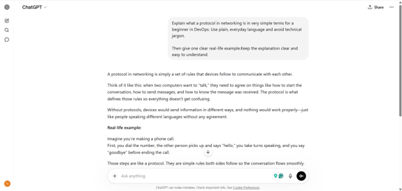
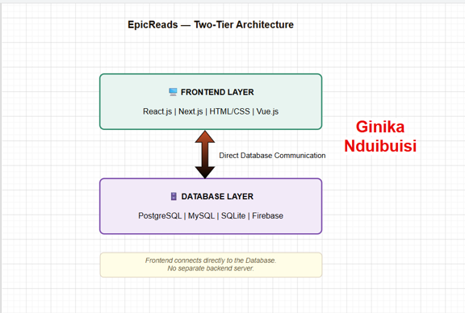
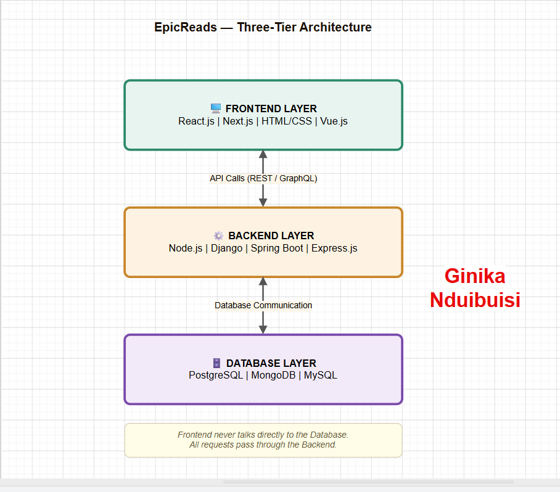
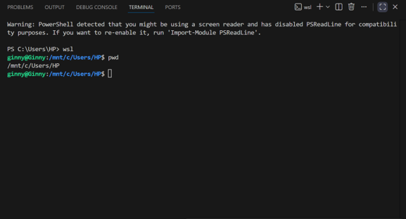

# Week 00 - Internet and Networking

Part of the DevOps Micro Internship (DMI) with Agentic AI

---

# 🧑‍💻 Task 1: Using ChatGPT as Your Learning Assistant

## Scenario

You're new to DevOps and will frequently encounter technical questions. ChatGPT can be your learning companion.

## Your Task

Write a clear ChatGPT prompt to help you understand:

> "What is a protocol in networking? Explain with a simple real-life example."

Take a screenshot of your interaction showing:

* Your detailed prompt (with clear expectations)
* ChatGPT's simplified response with an example

## Screenshot

Save your screenshot in the `screenshots` folder and update the file name below.




Replace `task-1-chatgpt.png` with your actual screenshot file name.

---

## What I Learned (2–3 lines)

I learned that networking protocols are the basic rules devices use to communicate with each other. I also learned that using simple real-life examples makes technical concepts much easier for beginners to understand. 


---

# 🌐 Task 2: Internet and Networking

## Scenario

Your friend is launching an online bookstore named **EpicReads**.

He asked you to explain how users globally can access his website hosted in Finland.

## Your Task

Write a short explanation (**100–150 words**) that includes:

* Packet Switching
* IP Address
* TCP/IP
* HTTP/HTTPS

💡 **Tip:** You may use ChatGPT (as demonstrated in Task 1) to refine your explanation.

## Answer

When a user anywhere in the world wants to access EpicReads, they open their browser and type the website address. The browser then sends a request using HTTP or HTTPS. HTTP is the basic rule for communication between a browser and a website, while HTTPS is the secure version that protects the data from being seen or changed by others.
This request travels over the internet using TCP/IP, which is the main system that allows computers to connect and exchange information reliably.
The request is sent to the EpicReads server in Finland, which is identified by a unique IP address. This IP address works like a digital home address, telling the internet exactly where to deliver the request.
Before sending, the data is broken into small parts called packets through packet switching. These packets may travel through different routes, but they all reach the same server, where they are reassembled and processed. The response is then sent back to the user’s browser, which displays the website.


---

# 🏗️ Task 3: Application Architecture & Stack

## Scenario

EpicReads bookstore has two application versions:

### Two-Tier Application

* Frontend
* Database

### Three-Tier Application

* Frontend
* Backend
* Database

## Your Task

* Draw simple diagrams (hand-drawn or tool-based such as draw.io)
* Label each layer clearly
* List at least two common technologies or tools used for each layer
* Submit a screenshot or photo clearly showing your own drawing

## Diagram Screenshot / Photo

Save your diagram image in the `screenshots` folder and update the file name below.





Replace `task-3-diagram.png` with your actual diagram file name.

---

## Technologies Used

### Frontend

* HTML
* React 

### Backend

* Node.js
* Python

### Database

* MySQL / PostgreSQL
* MongoDB

---

# 🌍 Task 4: Domain Name & DNS (Basic Concepts)

## Scenario

Your friend's bookstore **EpicReads** is currently accessible through:

```text
52.172.142.222:3000
```

He purchased the domain:

```text
epicreads.com
```

## Your Task

In **50–100 words**, explain in your own words:

1. What is DNS (Domain Name System)?
2. Which DNS record type should be used to connect the domain to the given IP, and why?

## Answer

DNS is like a contacts app on your phone. Instead of memorizing a friend's number, you just search their name. Similarly, DNS lets you type epicreads.com instead of 52.172.142.222. It looks up the address for you behind the scenes. A DNS record is just one contact saved in that app. 

The A Record is used. It is the contact type that saves an IP address. So when the IP is a number like that, the A Record is the right fit because it is the only record type built specifically to store that kind of address. 


---

# 💻 Task 5: Visual Studio Code Setup (Hands-on)

## Your Task

Install Visual Studio Code (if not already installed).

Take a screenshot of your VS Code environment showing:

* Terminal open inside VS Code
* Running a basic command:

### Windows

```powershell
dir
```

### Linux / macOS

```bash
pwd
ls
```

* Your selected VS Code theme clearly visible

⚠️ **Important:** The screenshot must show your username or another identifiable detail to confirm it is your environment.

## Screenshot

Save your screenshot in the `screenshots` folder and update the file name below.




Replace `task-5-vscode.png` with your actual screenshot file name.

---

# 🔗 Task 6: Publish Your Assignment as a LinkedIn Post

## Objective

Publishing on LinkedIn helps you:

* Build your professional online presence
* Reinforce your learning
* Document your DevOps journey publicly

## Your Task

Summarize your answers from Tasks 1–5 into a LinkedIn post.

Clearly structure your post into the following sections:

* ChatGPT
* Internet & Networking
* App Architecture
* DNS
* VS Code Setup

Use the credit note that matches your track:

Add the following credit note at the end of your post **(If you are DMI Cohort 3 student)**:

> **P.S. This post is part of the DevOps Micro Internship (DMI) with Agentic AI — Cohort 3 — by Pravin Mishra. My graded progress is public: https://dmi.pravinmishra.com/s/YOUR-GITHUB-USERNAME.html · Start your DevOps journey: https://dmi.pravinmishra.com/?utm_source=student&utm_medium=ps-linkedin&utm_campaign=cohort3**

**Tag [Pravin Mishra](https://www.linkedin.com/in/pravin-mishra-aws-trainer/) in your LinkedIn post, then tag Lead Co-Mentor — [Anjana Muthunayake](https://www.linkedin.com/in/anjana-muthunayake/).**

Add the following credit note at the end of your post **(If you are DMI Self-paced track student)**:

> **P.S. This post is part of the DevOps Micro Internship (DMI) — Self-Paced Engineer Track — by Pravin Mishra. My graded progress is public: https://dmi.pravinmishra.com/s/YOUR-GITHUB-USERNAME.html · Start your DevOps journey: https://dmi.pravinmishra.com/?utm_source=student&utm_medium=ps-linkedin&utm_campaign=self-paced**

Add the following credit note at the end of your post **(If you are DMI Campus student)**:

> **P.S. This post is part of the DevOps Micro Internship (DMI) — Campus — by Pravin Mishra. My graded progress is public: https://dmi.pravinmishra.com/s/YOUR-GITHUB-USERNAME.html · Start your DevOps journey: https://dmi.pravinmishra.com/?utm_source=student&utm_medium=ps-linkedin&utm_campaign=campus**

**Tag [Pravin Mishra](https://www.linkedin.com/in/pravin-mishra-aws-trainer/) in your LinkedIn post, then tag Lead Co-Mentor — [Anjana Muthunayake](https://www.linkedin.com/in/anjana-muthunayake/).**

Hashtags:

#DMIByPravinMishra #AgenticAI #DevOps

Replace `YOUR-GITHUB-USERNAME` with your GitHub username — that link is your public DMI progress page (your graded badge page).
---

## LinkedIn Post URL


```text
https://www.linkedin.com/posts/ginikandubuisi_week-0-of-my-devops-micro-internship-with-activity-7458076845335474176-7gDF?utm_source=share&utm_medium=member_desktop&rcm=ACoAAD6T0TgBum59kWGrvQdH9mZyCcgf18-giQo
```

---

## LinkedIn Post Backup Copy

Paste the full text of your LinkedIn post here:

Week 0 of my DevOps Micro Internship with Pravin Mishra and I already feel like a different person. 🔥

Here's what I covered:
✅ Used ChatGPT to simplify protocol in networking with real-life examples
✅ Learned how data travels the internet via TCP/IP, HTTP/HTTPS & packet switching
✅ Explored 2-tier & 3-tier app architecture using draw.io
✅ Understood DNS - basically a contacts app for the internet
✅ Set up VS Code and practiced basic terminal commands

Week 0 done. Let's go! 💪

P.S. This post is part of the FREE DevOps Micro Internship (DMI) Cohort 3 run by Pravin Mishra. You can be part of this learning community too.

JOIN HERE (https://lnkd.in/evfe86y5 ) DMI Cohort 3: https://lnkd.in/ebcsiA_K
Pravin Mishra Profile: https://lnkd.in/e77aZW_i

---

# Reflection – Week 0

### What did you find easy?

What I found easy was understanding the basic concepts when they were explained with simple real-life examples. Using ChatGPT also made it easier to break down technical ideas like networking protocols, DNS, and application architecture into something more understandable. 


---

### What was difficult?

What I found difficult was understanding the A Record in DNS at first. It took me a bit of time to fully grasp how it connects a domain name to an IP address. After reviewing it again and breaking it down, I eventually understood it clearly.

---

### What will you improve next week?

Next week, I want to focus on strengthening my understanding by practicing more and revisiting areas that felt confusing. I also want to improve how I connect different concepts together so I can better understand how everything works in a real-world system. 


---

## 📌 About DMI & CloudAdvisory

DevOps Micro Internship (DMI) is a project-based DevOps program run by Pravin Mishra (The CloudAdvisory) focused on real-world execution, systems thinking, and career readiness.

It helps learners build strong DevOps foundations with hands-on experience.


## 📌 Resources

- 🌐 **DMI Official Website:** https://dmi.pravinmishra.com?utm_source=github&utm_medium=readme  
- 🎓 **University:** https://university.pravinmishra.com?utm_source=github&utm_medium=readme  
- 💬 **Discord Community:** https://discord.pravinmishra.com?utm_source=github&utm_medium=readme  
- 📝 **Blog:** https://dmi.pravinmishra.com/blog?utm_source=github&utm_medium=readme  
- ▶️ **YouTube Playlist (DMI Cohort 3):** https://www.youtube.com/playlist?list=PLFeSNDtI4Cho  
- 🔗 **Pravin Mishra (LinkedIn):** https://www.linkedin.com/in/pravin-mishra-aws-trainer/  
- 🏢 **CloudAdvisory (LinkedIn):** https://www.linkedin.com/company/thecloudadvisory/

---

*This submission is part of DevOps Micro Internship (DMI) — Agentic AI Track*