# Assignment 3 — Production Maintenance Drill (OPS Checklist)

Part of the DevOps Micro Internship (DMI) Cohort 3 with Agentic AI

---

## Purpose

In this assignment, you will treat your already deployed React application (on Ubuntu VM with Nginx) as a live production system. You will perform structured operational checks covering network validation, service health, log analysis, resource monitoring, configuration verification, and incident simulation with recovery — mirroring real on-call DevOps responsibilities.

---

# Task 1 — Server Access & Networking Validation

## Goal

Verify that the deployed React application is reachable from the browser and confirm basic network connectivity of the Ubuntu VM.

### Evidence

#### Screenshot 1 — Browser showing the React app with your Full Name visible on the UI

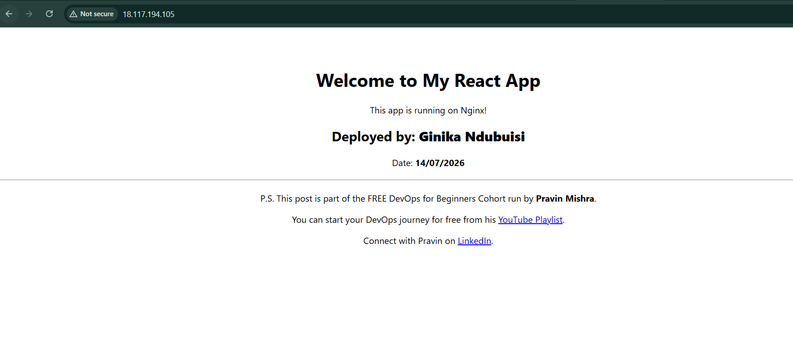

---

#### Screenshot 2 — Output of `ip a`

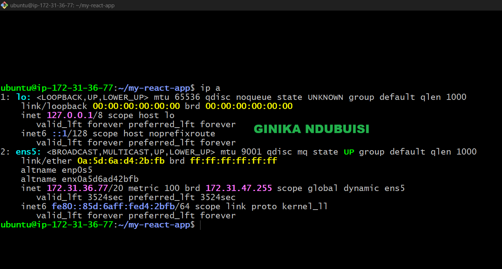

---

#### Screenshot 3 — Output of `sudo ss -tulpen`

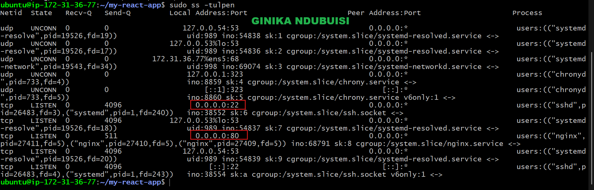

---

#### Screenshot 4 — Output of `sudo ufw status`

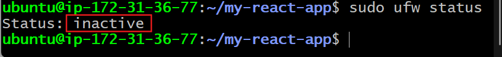

---

### Notes

Answer the following in your own words:

**1. What proves Nginx is listening on 0.0.0.0:80?**

The ss -tulpen output shows 0.0.0.0:80 in the LISTEN state confirming SSH is active on port 80.

---

**2. What proves SSH is active on port 22?**

The ss -tulpen output shows 0.0.0.0:22 in the LISTEN state confirming SSH is active on port 22.

---

**3. Did you find any unexpected open ports? Explain briefly.**

No. The only open ports were 22 (SSH) and 80 (HTTP/Nginx). The remaining services (systemd-resolved, systemd-networkd, and chronyd) are bound to localhost or the private network interface, so they are not unexpected or publicly exposed.

---

# Task 2 — Service Health & Systemd Validation (Nginx)

## Goal

Verify that Nginx is properly installed, running, enabled at boot, and safely configured.

### Evidence

#### Screenshot 1 — Output of `systemctl status nginx --no-pager`

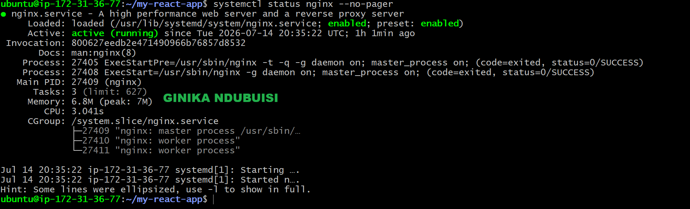

---

#### Screenshot 2 — Output of `sudo nginx -t`

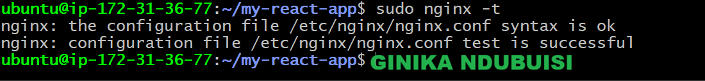

---

#### Screenshot 3 — Output of `sudo ss -lptn '( sport = :80 )'`

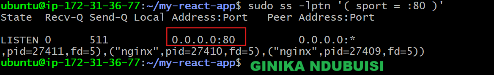
---

### Notes

Answer the following in your own words:

**1. What happens if Nginx fails to restart in production?**

If Nginx fails to restart, users won't be able to access the website because it won't be serving requests on port 80. This could happen after a deployment or configuration change, causing downtime until the problem is identified and Nginx is started successfully.

---

**2. What's your basic rollback plan?**

Before making any changes, I would first test the Nginx configuration using sudo nginx -t to make sure there are no errors. If Nginx fails to restart, I would check the service status and logs to identify the problem. If the issue is caused by a configuration change, I would restore the previous working configuration, test it again, and then restart Nginx. Keeping a backup of the last working configuration makes the rollback much faster.

---

# Task 3 — Logs & Request Trace

## Goal

Verify real traffic flow and analyze logs to understand system behavior and errors.

### Evidence

#### Screenshot 1 — Output of `sudo tail -n 30 /var/log/nginx/access.log`

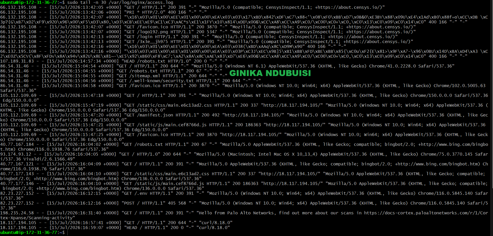

---

#### Screenshot 2 — Output of `sudo tail -n 30 /var/log/nginx/error.log`

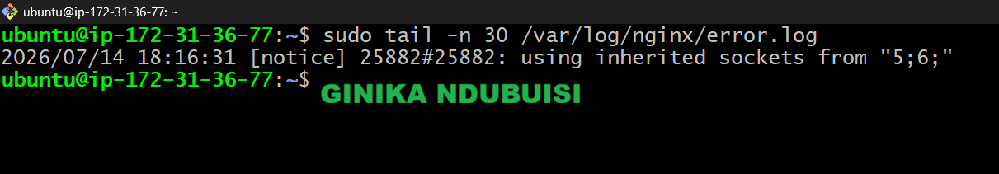

---

#### Screenshot 3 — Output of `sudo journalctl -u nginx --no-pager -n 50`

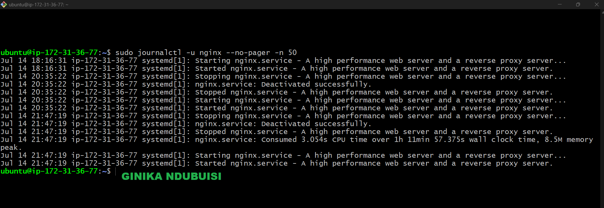
---

### Notes

Answer the following in your own words:

**1. Were there any errors in the logs?**

- If yes, mention 1–2 example error lines from the logs and explain what each one means in simple terms.
- If no, explain what it means if the error log is empty or shows no recent errors during your check.

No error, it means that during the specific time window I looked at, nginx didn't run into any problems it needed to flag. It's a sign the server was operating normally at that point in time. It doesn't mean errors can never happen but it just means nothing went wrong in the period you actually checked.

---

**2. If there were no errors, what does that indicate about the system?**

If there were no errors, it indicates the system is currently healthy and stable. Nginx is running, starting, and stopping the way it should without hitting any internal problems or misconfigurations. 

---

**3. Based on the access logs, were your curl requests visible in the log entries? What does that prove about traffic flow?**

Yes, my curl requests were visible in the access log. They showed up as the two most recent entries. This proves the traffic flow was working end-to-end: the request left my machine, reached the server, was received and logged by nginx, and a response was sent back successfully. In other words, the connection between client and server was working properly at the time of the test.

---

# Task 4 — System Resource Health Check (Capacity Red Flags)

## Goal

Assess server capacity and detect potential performance or failure risks.

### Evidence

#### Screenshot 1 — Output of `uptime`

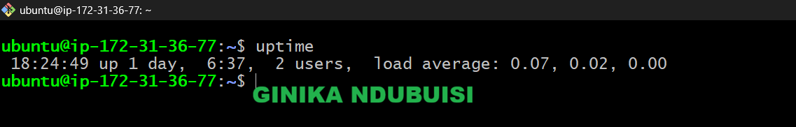

---

#### Screenshot 2 — Output of `free -h`

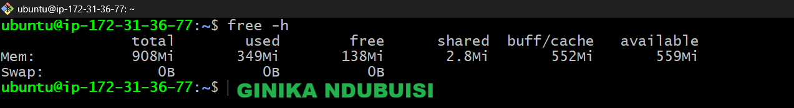
---

#### Screenshot 3 — Output of `df -h`

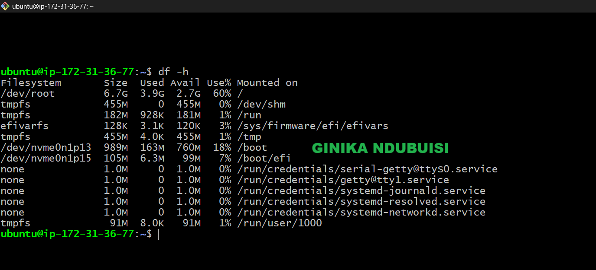

---

#### Screenshot 4 — Output of `sudo du -sh /var/* | sort -h`

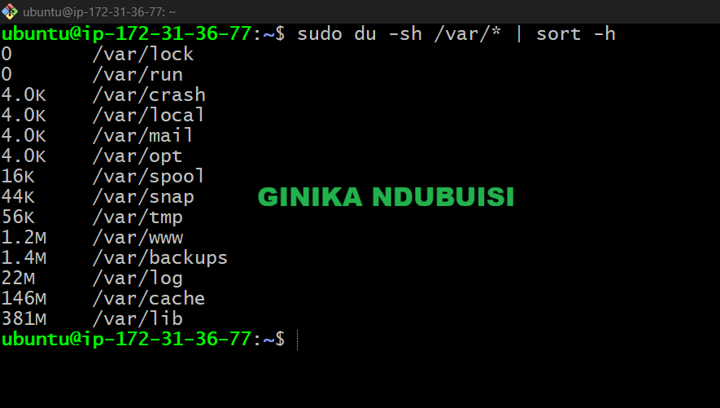

---

### Notes

Answer the following in your own words:

**1. Which resource looks most critical right now? (CPU/load, memory, or disk) Explain why.**

At the moment, none of the resources are under heavy load. CPU usage is low, memory has enough available space with no swap being used, and disk usage is at a healthy level. If I had to keep a closer eye on one resource, it would be disk space because it can gradually fill up over time due to logs or other files, which could eventually affect the server if left unchecked.

---

**2. What happens if disk becomes 100% full in a production server?**

If the disk becomes 100% full, the server won't be able to save new logs, temporary files, or application data. This can cause applications and services to fail, and in some cases even prevent users from accessing the server through SSH. If not resolved quickly, it can lead to downtime and make troubleshooting more difficult because new logs can't be written.

---

# Task 5 — Configuration & Deployment Verification

## Goal

Ensure the correct React build is deployed and Nginx is serving it properly.

### Evidence

#### Screenshot 1 — Output of `ls -lah /var/www/html | head -n 20`

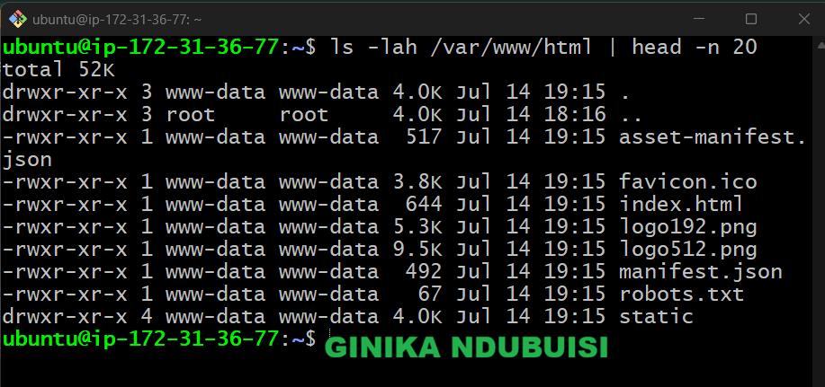

---

#### Screenshot 2 — Output of `grep -R "Deployed by" -n /var/www/html 2>/dev/null | head`

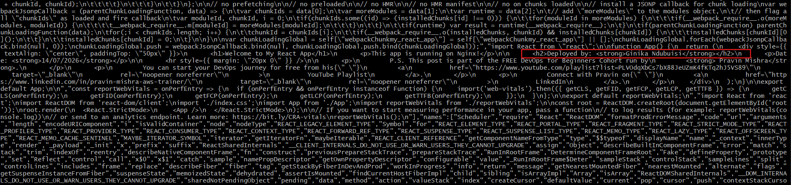

---

#### Screenshot 3 — Output of `grep -n "try_files" /etc/nginx/sites-available/default`

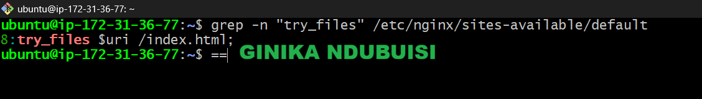

---

### Notes

Answer the following in your own words:

**1. How do you confirm that the correct version of the application is deployed?**

I confirmed the correct version was deployed by first checking that the production build files were in the Nginx web root using ls -lah /var/www/html. I then used grep -R "Deployed by" to verify that my custom changes were included in the deployed build. Next, I checked the Nginx configuration with grep -n "try_files" to confirm it was set up to serve the React application correctly. Finally, I opened the application in a browser to verify that the live site displayed the expected version.

---

# Task 6 — Nginx Configuration Failure Simulation

## Goal

Simulate a real-world Nginx misconfiguration and recover the service safely.

### Evidence

#### Screenshot 1 — Output of `sudo nginx -t` showing the syntax error (broken config)

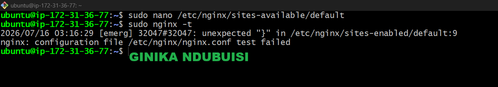

---

#### Screenshot 2 — Output of `sudo nginx -t` showing syntax ok (fixed config)

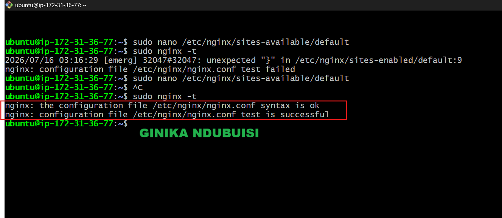
---

#### Screenshot 3 — Output of `curl -I http://<public-ip>` confirming recovery (200 OK)

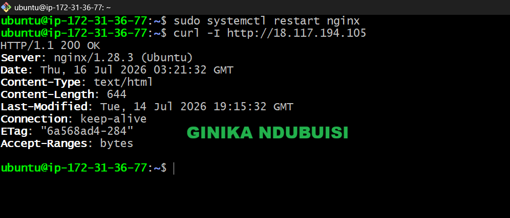

---

### Notes

Answer the following in your own words:

**1. What caused the configuration failure?**

The configuration failed because the semicolon (;) at the end of the try_files $uri /index.html; was missing. This caused a syntax error, preventing Nginx from validating the configuration and restarting successfully.

---

**2. How did you fix the issue?**

I reopened the Nginx configuration file in nano, added the missing semicolon to the try_files directive, saved it and ran sudo nginx -t to make sure the configuration was valid. After the test passed successfully, I restarted Nginx using sudo systemctl restart nginx and verified the application was working again by using curl -I command and/or checking it in the browser.

---

**3. How can you avoid this kind of issue in real production systems?**

To avoid this kind of issue, I would always run sudo nginx -t after making any configuration changes to check for syntax errors before restarting Nginx. I would also keep a backup or use version control so I can quickly restore a working configuration if something goes wrong. In a production environment, it's also good practice to test configuration changes in a staging environment before applying them to the live server.

---

# Task 7 — Web Application Failure Simulation

## Goal

Simulate missing deployment content and recover the application safely.

### Evidence

#### Screenshot 1 — Output of `curl -I http://<public-ip>` showing failure (non-200 response)

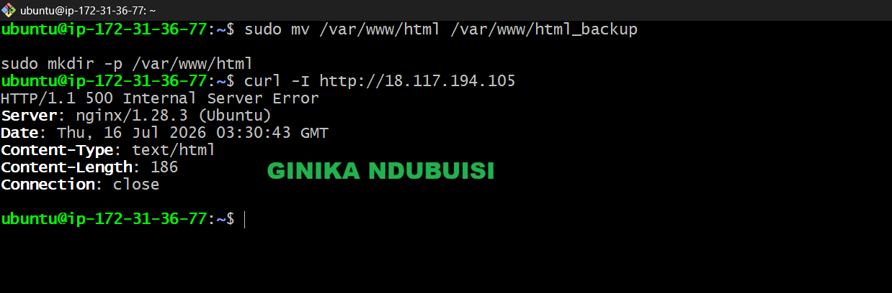

---

#### Screenshot 2 — Output of `curl -I http://<public-ip>` confirming recovery (200 OK)

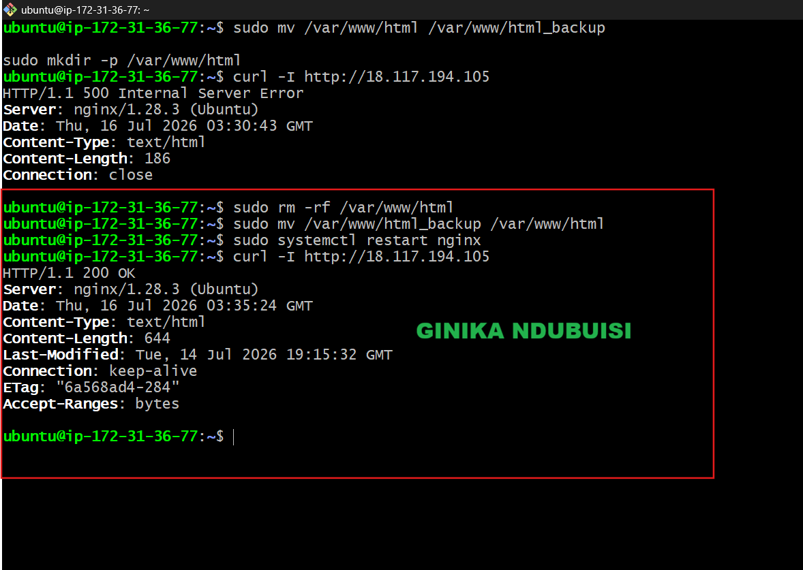
---

### Notes

Answer the following in your own words:

**1. What caused the application to break in this scenario?**

The application stopped working because the files in the Nginx web root (/var/www/html) were removed. Although Nginx was still running, it had no application files to serve, so users could no longer access the React application and the server returned an error.

---

**2. How did you fix the issue and restore the application?**

I restored the application by moving the backup files back to the /var/www/html directory. After that, I restarted Nginx to ensure it was serving the restored files correctly. Finally, I used curl -I to confirm the application was responding successfully again.

---

**3. What steps would you take to prevent this kind of issue in real production systems?**

To prevent this in a production environment, I would always keep a backup of the current deployment before making changes so I can quickly restore it if needed. I would also deploy new versions to a separate directory and only switch to the new version after confirming it works correctly. This helps avoid downtime if a deployment fails.

---

# Task 8 — Security & Reliability Review

## Goal

Review and reflect on the security and reliability practices applied during this assignment.

### Security & Reliability Notes

Answer the following in your own words:

**1. Why is SSH key-based authentication more secure than sharing passwords?**

SSH key-based authentication is more secure because it uses a unique key pair instead of a password that can be guessed or stolen. It also reduces the risk of brute-force attacks and makes unauthorized access much more difficult.

---

**2. Why should only required ports be open on a production server?**

Only the ports needed for the application should be open to reduce the server's exposure to attacks. Closing unnecessary ports helps improve security by limiting the number of possible entry points.

---

**3. Why is it important for Nginx to be enabled on boot?**

Enabling Nginx on boot ensures the web server starts automatically whenever the server restarts. This helps keep the application available without requiring someone to start the service manually.

---

**4. What are the risks of sharing secrets, keys, or credentials publicly?**

If secrets, keys, or credentials are exposed, unauthorized users could gain access to servers, applications, or cloud resources. This can lead to data breaches, service disruptions, or unexpected costs.

---

**5. Why should cloud resources be stopped or terminated when they are no longer needed?**

Stopping or terminating unused cloud resources helps reduce unnecessary costs and minimizes the number of systems that could be targeted if left running. It also keeps the cloud environment organized and easier to manage.

---

# LinkedIn Post (Required)

## Evidence

#### LinkedIn Post URL

Paste your LinkedIn post URL here:

`https://www.linkedin.com/posts/ginikandubuisi_with-the-react-application-i-deployed-in-share-7483409593642119170-QNun/?utm_source=share&utm_medium=member_desktop&rcm=ACoAAD6T0TgBum59kWGrvQdH9mZyCcgf18-giQo`

---

#### Screenshot — Published LinkedIn post

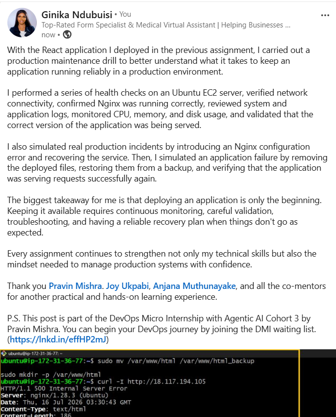

---

# Submission Instructions

- Add all required screenshots in your submission
- Full name must be visible in required screenshots
- Do not expose sensitive information (keys, passwords, account IDs)

---

# Completion Checklist

- [ ] Task 1: Screenshots (browser, ip a, ss -tulpen, ufw status) + Notes answered
- [ ] Task 2: Screenshots (nginx status, nginx -t, ss port 80) + Notes answered
- [ ] Task 3: Screenshots (access log, error log, journalctl) + Notes answered
- [ ] Task 4: Screenshots (uptime, free -h, df -h, du -sh) + Notes answered
- [ ] Task 5: Screenshots (ls html, grep deployed by, grep try_files) + Notes answered
- [ ] Task 6: Screenshots (nginx -t fail, nginx -t pass, curl recovery) + Notes answered
- [ ] Task 7: Screenshots (curl failure, curl recovery) + Notes answered
- [ ] Task 8: Security & Reliability Notes answered
- [ ] LinkedIn post published and URL submitted
- [ ] Full Name visible in all required screenshots
- [ ] No sensitive data exposed

---

## 📌 About DMI & CloudAdvisory

DevOps Micro Internship (DMI) is a project-based DevOps program run by Pravin Mishra (The CloudAdvisory) focused on real-world execution, systems thinking, and career readiness.

It helps learners build strong DevOps foundations with hands-on experience.

---

## 📌 Resources

- 🌐 DMI Official Website: https://pravinmishra.com/dmi  
- 🎓 DevOps for Beginners (Udemy): https://www.udemy.com/course/devops-for-beginners-docker-k8s-cloud-cicd-4-projects/  
- 🎓 Agentic AI DevOps with Claude Code: https://www.udemy.com/course/ultimate-agentic-ai-devops-with-claude-code/  
- 🎓 DevOps with Claude Code: Terraform, EKS, ArgoCD & Helm: https://www.udemy.com/course/devops-with-claude-code-terraform-eks-argocd-helm/  
- ▶️ YouTube Playlist: https://www.youtube.com/playlist?list=PLFeSNDtI4Cho  
- 🔗 Pravin Mishra (LinkedIn): https://www.linkedin.com/in/pravin-mishra-aws-trainer/  
- 🏢 CloudAdvisory (LinkedIn): https://www.linkedin.com/company/thecloudadvisory/

---

*This submission is part of DevOps Micro Internship (DMI) Cohort 3 — Agentic AI Track.*