# Assignment 5 — Bash Script Automation Drill (OPS Checklist)

Part of the DevOps Micro Internship (DMI) with Agentic AI

---

## Purpose

In this assignment, you will practice Bash scripting by building a series of small automation scripts covering environment setup, variables, arrays, loops, file conditionals, if-else logic, and functions. These scripts form the foundation of real-world Linux automation used in DevOps, cloud, and production support environments.

---

# Task 1 — Bash Environment & Workspace Setup

## Goal

Verify that Bash is available on your system and create a clean workspace for this assignment.

### Evidence

#### Screenshot 1 — Output of `echo $SHELL` and `bash --version`

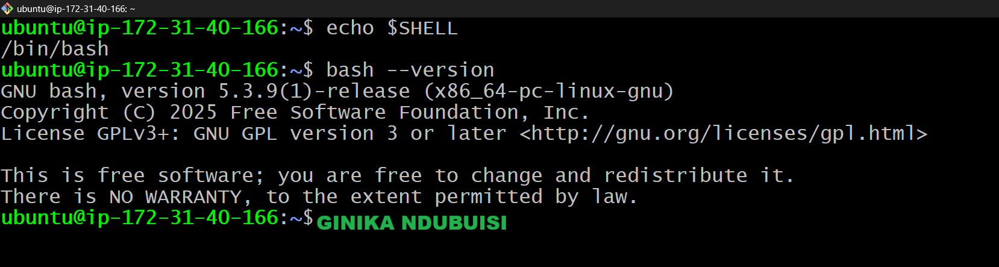

---

#### Screenshot 2 — Output of `pwd` and `ls -lah` showing the scripts directory

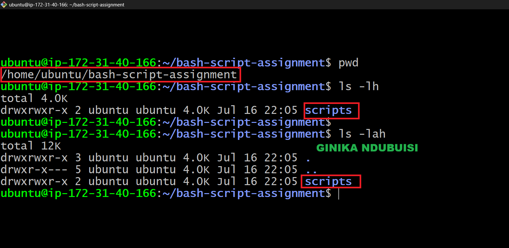

---

### Notes

Answer the following in your own words:

**1. What is Bash?**

Bash is Bourne Again Shell. It's a command-line that allows users to communicate with the operating system through the terminal. Instead of using a graphical interface, you type commands to perform tasks such as creating files, managing directories, installing software, and running applications. Bash also supports scripting, which means you can write a series of commands in a file and execute them automatically. This makes it a powerful tool for automating routine tasks and managing systems more efficiently.

---

**2. What is the difference between shell and Bash?**

A shell is a command-line interface that allows users to communicate with the operating system by entering commands. Bash is one of the many shells available for Linux and Unix-based systems. While all shells let you execute commands and run scripts, each has its own set of features, command syntax, customization options, and scripting capabilities. Bash is the most commonly used shell because it is reliable, user-friendly, and supported by most Linux distributions.

---

**3. Why is it important to confirm the Bash version before writing scripts?**

Checking the Bash version before writing a script helps you know which features and syntax are available on the system. Since some Bash functions are only supported in newer versions, verifying the version helps prevent compatibility issues and reduces the chances of your script failing when it runs.

---

# Task 2 — Your First Bash Script

## Goal

Create your first Bash script, make it executable, and run it from the terminal.

### Evidence

#### Screenshot 1 — Content of `first-script.sh`

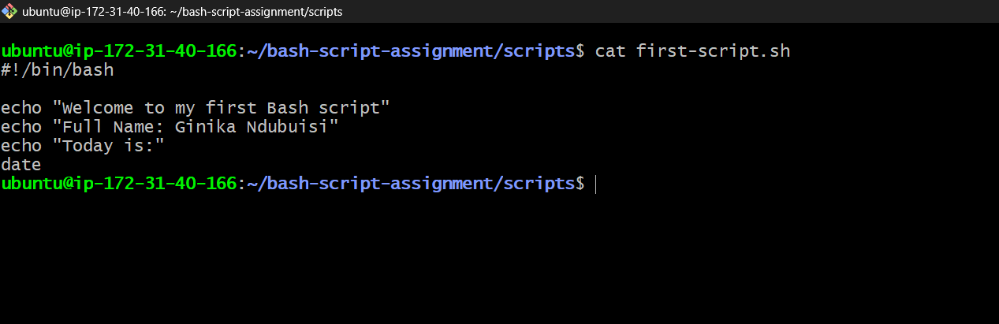

---

#### Screenshot 2 — Output of `./first-script.sh`

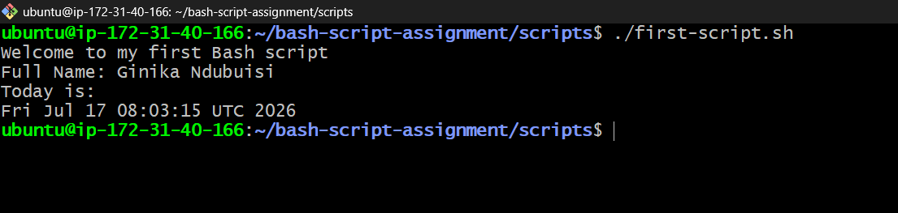

---

#### Screenshot 3 — Output of `ls -l first-script.sh` showing executable permission

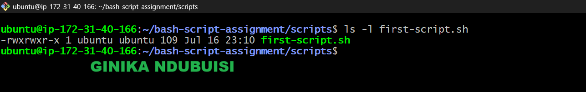

---

### Notes

Answer the following in your own words:

**1. What is the purpose of `#!/bin/bash`?**

#!/bin/bash is known as the shebang. It appears at the beginning of a script and tells the operating system to use the Bash interpreter to execute the commands in that file. This ensures the script runs with Bash regardless of the user's default shell.

---

**2. Why do we use `chmod +x` before running a script?**

The chmod +x command gives a script permission to be executed. Without this permission, the operating system will prevent the script from running directly. After making it executable, you can start it using ./script.sh.

---

**3. What is the difference between running a script using `./script.sh` and `bash script.sh`?**

Running ./script.sh executes the script as a standalone program. For this to work, the script must have execute permission, and the operating system uses the interpreter specified in the shebang line.

Running bash script.sh starts the Bash interpreter first and then passes the script to it for execution. In this case, the script does not need execute permission because Bash is reading the file directly, and the script is run with Bash regardless of the shebang line.

---

# Task 3 — Variables: User Information Script

## Goal

Use variables to store and display user-related information.

### Evidence

#### Screenshot 1 — Content of `user-info.sh`

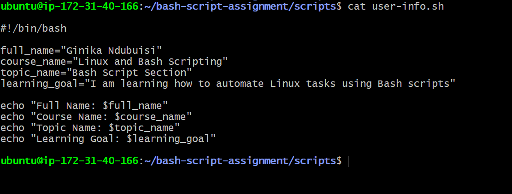

---

#### Screenshot 2 — Output of `./user-info.sh`

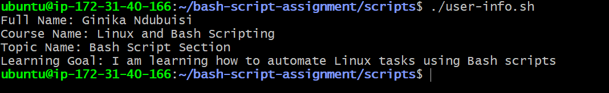

---

### Notes

Answer the following in your own words:

**1. What is a variable in Bash?**

A variable in Bash is a named container used to hold data that can be reused throughout a script. Instead of typing the same value multiple times, you store it in a variable and reference it whenever needed. Variables can store text, numbers, file paths, or the output of commands.

---

**2. Why should we avoid spaces around the `=` sign when creating variables?**

When assigning a value to a variable in Bash, there must be no spaces before or after the = sign. Bash expects the assignment to be written as a single expression. If spaces are added, it interprets the parts separately, often treating the variable name as a command, which results in an error.

---

**3. How do you access the value stored inside a Bash variable?**

To retrieve the value stored in a variable, place a $ before its name. This tells Bash to replace the variable with the value it contains.

---

# Task 4 — Arrays & Loops: Tools Checklist Script

## Goal

Use arrays and loops to print a checklist of tools used in Bash scripting.

### Evidence

#### Screenshot 1 — Content of `tools-checklist.sh`

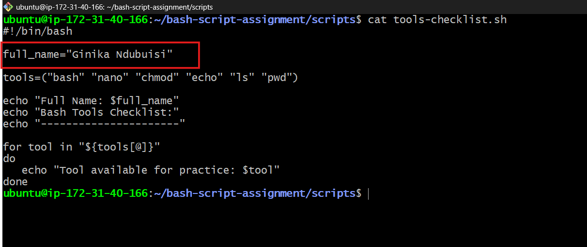

---

#### Screenshot 2 — Output of `./tools-checklist.sh`

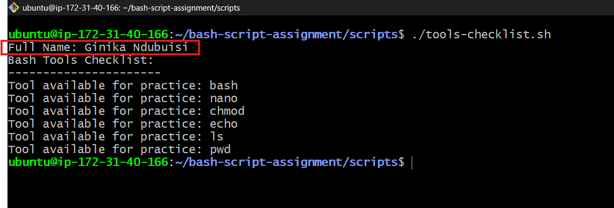

---

### Notes

Answer the following in your own words:

**1. What is an array in Bash?**

An array is a data structure in Bash that lets you store multiple values in a single variable. Each value is stored at a different position, making it easy to group related information instead of creating many separate variables.

---

**2. Why are arrays useful in scripts?**

Arrays make scripts more organized and easier to maintain. They allow you to store a collection of related items in one place, so you can work with all of them without creating multiple variables. If you need to add or remove an item, you only update the array instead of changing several parts of the script.

---

**3. What does `"${tools[@]}"` mean?**

"${tools[@]}" refers to every element stored in the tools array. When used in a loop, it passes each item one at a time. The quotation marks ensure that each array element is treated as a separate value, even if an element contains spaces.

---

**4. What is the purpose of the `for` loop in this script?**

The `for` loop is used to process every item in the array automatically. It takes each value from the tools array, stores it temporarily in the tool variable, and performs the specified action. In this case, the loop prints each tool to the terminal, repeating the process until it reaches the last item in the array.

---

# Task 5 — Loops: Number Counter Script

## Goal

Use loops to repeat a task multiple times.

### Evidence

#### Screenshot 1 — Content of `counter.sh`

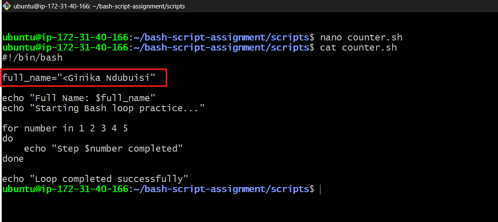

---

#### Screenshot 2 — Output of `./counter.sh`

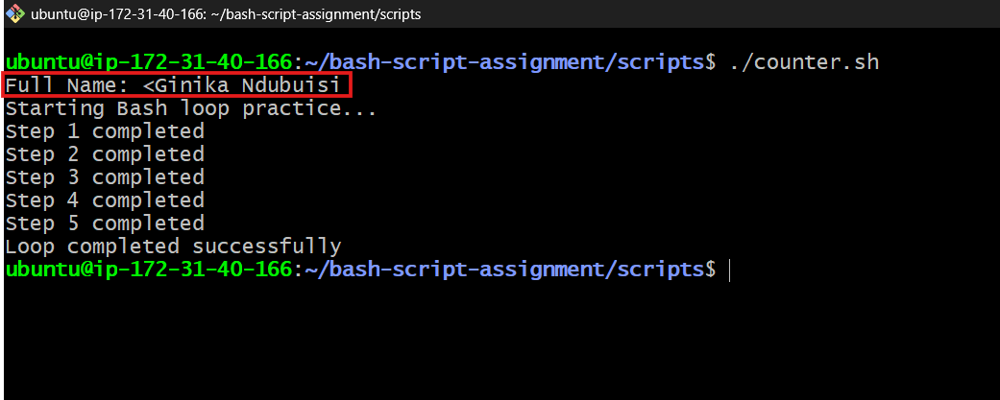

---

### Notes

Answer the following in your own words:

**1. What is a loop?**

A loop is a programming structure that repeatedly executes a block of code until all specified values have been processed or a condition is met. It helps eliminate the need to write the same commands multiple times.

---

**2. Why do we use loops in Bash scripting?**

Loops are used to automate repetitive tasks, making scripts more efficient and easier to maintain. They reduce duplicated code, improve readability, and allow the same operation to be performed on multiple items with minimal effort.

---

**3. How many times did the loop run in your script?**

The loop executed five times because it was given five values: 1, 2, 3, 4, and 5. During each iteration, the loop processed one number and displayed the corresponding message before moving to the next value.

---

**4. What would you change if you wanted the loop to run 10 times?**

To make the loop execute ten times, I would include the numbers 6 through 10 in the list of values.

for number in 1 2 3 4 5 6 7 8 9 10
do
    echo "Step $number completed"
done

This change causes the loop to run once for each number from 1 to 10, resulting in a total of ten iterations.

---

# Task 6 — Files & Conditionals: File Validation Script

## Goal

Use file checks and conditionals to verify whether files and directories exist.

### Evidence

#### Screenshot 1 — Output of `ls -lah ../test-folder`

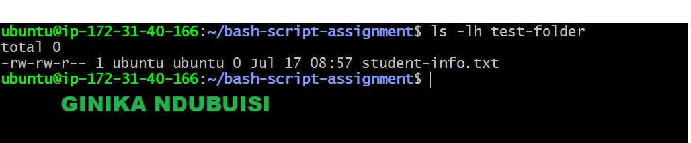

---

#### Screenshot 2 — Content of `file-check.sh`

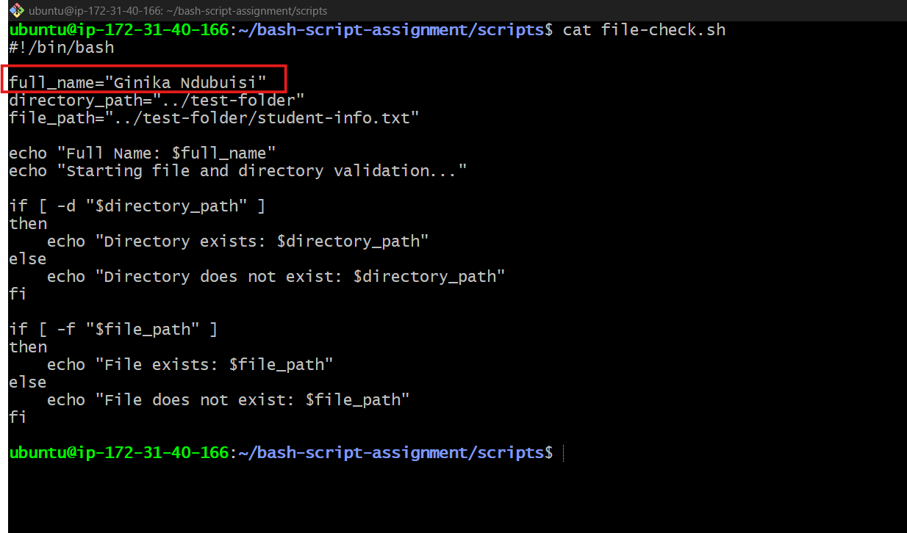

---

#### Screenshot 3 — Output of `./file-check.sh`

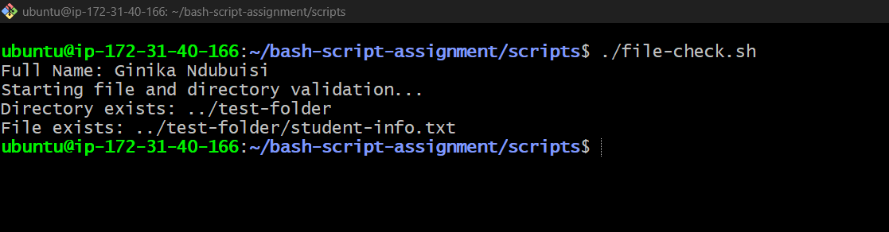

---

### Notes

Answer the following in your own words:

**1. What does `-d` check in Bash?**

The `-d` test is used to determine whether a specified path points to an existing directory. It returns true if the directory is found; otherwise, it returns false.

---

**2. What does `-f` check in Bash?**

The -f test verifies whether a given path refers to an existing regular file. If the file is present, the condition evaluates to true. If it is missing or the path points to something other than a regular file, the result is false.

---

**3. Why should file and directory paths be stored in variables?**

Using variables for file and directory paths makes scripts more flexible and easier to maintain. Instead of editing the same path in multiple places, you only need to update the variable once. This approach also improves readability and reduces the risk of errors.
---

**4. What happens if the file does not exist?**

When the specified file cannot be found, the -f condition evaluates to false. As a result, the script skips the commands in the if block and executes the else block instead, displaying a message that the file could not be found.

---

# Task 7 — Conditionals: Pass or Retry Script

## Goal

Use if-else conditionals to make decisions based on a variable value.

### Evidence

#### Screenshot 1 — Content of `score-check.sh` with `score=85`

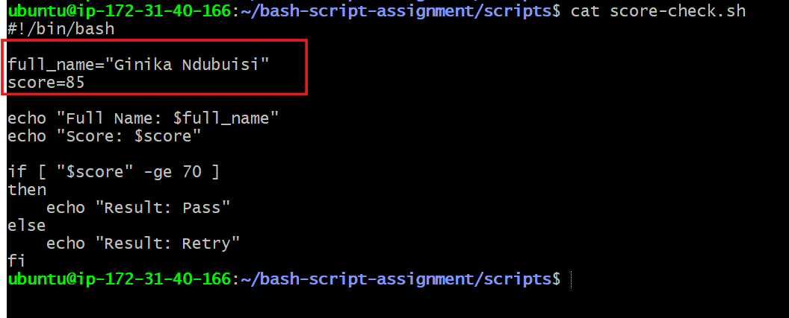

---

#### Screenshot 2 — Output showing `Result: Pass`

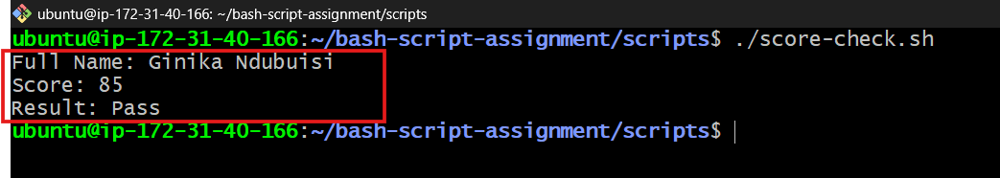

---

#### Screenshot 3 — Content of `score-check.sh` with `score=55`

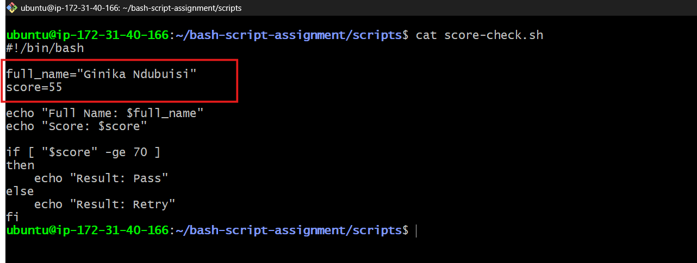

---

#### Screenshot 4 — Output showing `Result: Retry`

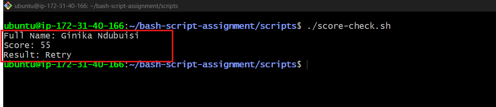

---

### Notes

Answer the following in your own words:

**1. What is the purpose of if-else in Bash?**

An if-else statement is used to control the flow of a script by making decisions. It evaluates a condition and executes one block of code if the condition is true. If the condition is false, it skips that block and runs the alternative commands in the else section.

---

**2. What does `-ge` mean?**

The -ge comparison operator stands for greater than or equal to. It is used to compare two numeric values and checks whether the first number is at least as large as the second.

---

**3. Why should conditions be tested with different values?**

Testing a condition with different values helps confirm that the script behaves correctly in every scenario. It verifies that both the true and false branches work as expected and helps identify any logic errors. It's also important to test boundary values, such as 70 in this example, to ensure the comparison produces the correct result.

---

**4. How can conditionals help in automation scripts?**

Conditionals enable automation scripts to respond to different situations without user intervention. A script can evaluate system conditions—such as checking whether a file exists, a service is running, or available disk space is low—and then perform the appropriate action based on the result. This makes automation more reliable and adaptable to changing conditions.

---

# Task 8 — Functions: Final Bash Automation Script

## Goal

Create a final Bash script using functions to organize reusable code.

### Evidence

#### Screenshot 1 — Content of `final-automation.sh`

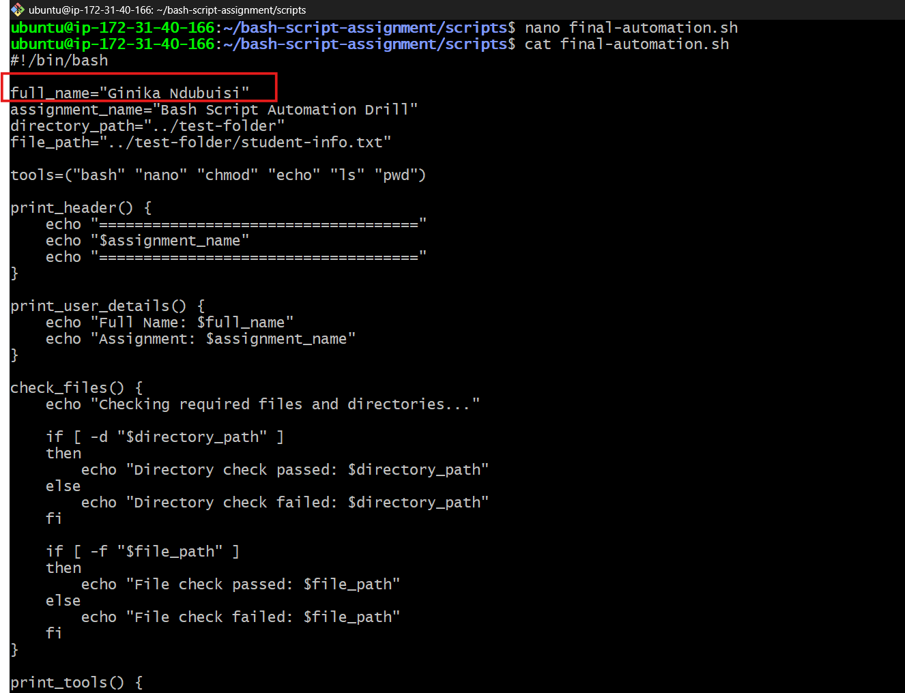

---

#### Screenshot 2 — Output of `./final-automation.sh`

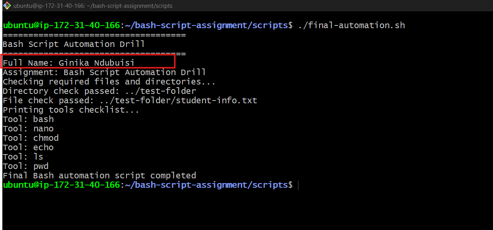

---

#### Screenshot 3 — Output of `ls -lah` showing all created scripts

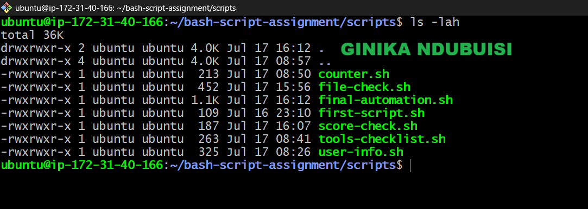

---

### Notes

Answer the following in your own words:

**1. What is a function in Bash?**

A function is a reusable section of code that performs a specific task. Instead of writing the same commands multiple times, you define them once inside a function and execute them whenever needed by calling the function's name.

---

**2. Why are functions useful in scripts?**

Functions make scripts more organized by breaking them into smaller, meaningful sections. They reduce code duplication, improve readability, and make scripts easier to update and debug. If a task needs to be performed in several places, you only need to modify the function instead of changing the same code multiple times.

---

**3. Which functions did you create in this script?**

This script contains four functions, each responsible for a different part of the program:

print_header displays the title of the assignment.
print_user_details prints my full name and the assignment information.
check_files verifies that the required directory and file are available.
print_tools loops through the array and displays each tool in the list.

Each function has a single purpose, making the script easier to understand and maintain.

---

**4. How does this final script combine variables, arrays, loops, conditionals, files, and functions?**

The script brings together several Bash features to complete a single task. Variables store important information such as my name, the assignment title, and file paths. An array holds the list of tools, while a for loop processes and displays each item. Conditional statements use -d and -f to verify that the required directory and file exist before continuing. Finally, all related commands are grouped into functions, which are called in sequence to produce a clean, well-structured, and reusable automation script.

---

# LinkedIn Post (Required)

## Evidence

#### LinkedIn Post URL

Paste your LinkedIn post URL here:

<<<<<<< HEAD
`https://www.linkedin.com/posts/ginikandubuisi_devops-linux-bash-share-7483940001433579521-43el/?utm_source=share&utm_medium=member_desktop&rcm=ACoAAD6T0TgBum59kWGrvQdH9mZyCcgf18-giQo`
=======
`Add your URL here`
>>>>>>> upstream/main

---

#### Screenshot — Published LinkedIn post

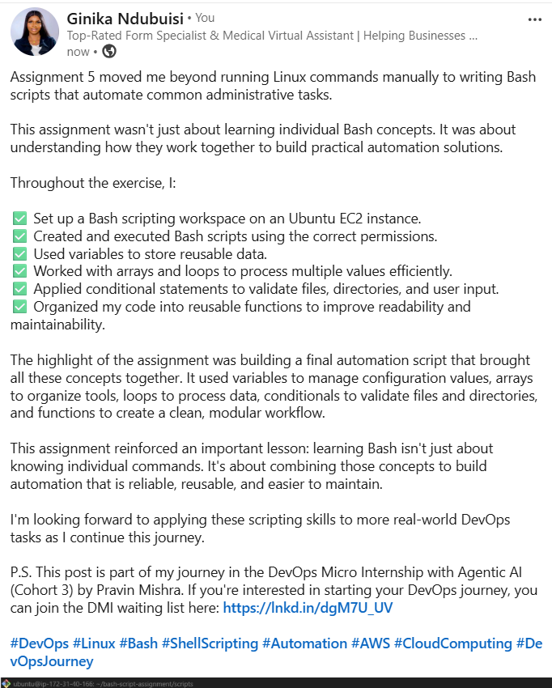
---

# Submission Instructions

- Add all required screenshots in your submission
- Full name must be visible in required screenshots
- All script files must be created and run successfully
- Required notes must be answered clearly for every task
- Do not expose sensitive information (keys, passwords, credentials)

---

# Completion Checklist

- [ ] Task 1: Environment setup verified, workspace created (Screenshots 1–2, Notes answered)
- [ ] Task 2: First script created, executed, permissions verified (Screenshots 1–3, Notes answered)
- [ ] Task 3: Variables script created and run (Screenshots 1–2, Notes answered)
- [ ] Task 4: Arrays and loops script created and run (Screenshots 1–2, Notes answered)
- [ ] Task 5: Counter loop script created and run (Screenshots 1–2, Notes answered)
- [ ] Task 6: File validation script created and run (Screenshots 1–3, Notes answered)
- [ ] Task 7: Pass/Retry conditional script tested with both values (Screenshots 1–4, Notes answered)
- [ ] Task 8: Final automation script created and run (Screenshots 1–3, Notes answered)
- [ ] All scripts run without errors
- [ ] Full Name visible in all required screenshots
- [ ] LinkedIn post published and URL submitted
- [ ] No sensitive data exposed

---

## 📌 About DMI & CloudAdvisory

DevOps Micro Internship (DMI) is a project-based DevOps program run by Pravin Mishra (The CloudAdvisory) focused on real-world execution, systems thinking, and career readiness.

It helps learners build strong DevOps foundations with hands-on experience.

---

## 📌 Resources

- 🌐 DMI Official Website: https://dmi.pravinmishra.com?utm_source=github&utm_medium=readme  
- 🎓 University: https://university.pravinmishra.com?utm_source=github&utm_medium=readme  
- 💬 Discord Community: https://discord.pravinmishra.com?utm_source=github&utm_medium=readme  
- 📝 Blog: https://dmi.pravinmishra.com/blog?utm_source=github&utm_medium=readme  
- ▶️ YouTube Playlist: https://www.youtube.com/playlist?list=PLFeSNDtI4Cho  
- 🔗 Pravin Mishra (LinkedIn): https://www.linkedin.com/in/pravin-mishra-aws-trainer/  
- 🏢 CloudAdvisory (LinkedIn): https://www.linkedin.com/company/thecloudadvisory/

---

*This submission is part of DevOps Micro Internship (DMI) — Agentic AI Track.*