# Assignment 6 — Build an AI-Assisted Linux Health Check (AI-Assisted Linux Incident Triage)

Part of the DevOps Micro Internship (DMI) with Agentic AI

---

## Purpose

In this assignment, you will build a read-only Bash triage script that checks the health of your Ubuntu server and Nginx application, connect it to Claude Code as a reusable `/linux-triage` skill, simulate a controlled Nginx incident, use the skill to gather and analyze evidence, recover the service manually, and verify recovery. The workflow follows the Agentic Loop: Gather → Analyze → Human Act → Verify.

---

# Task 1 — Confirm the Healthy Baseline and Create the Workspace

## Goal

Confirm that Nginx and the React application are healthy before building the automation.

### Evidence

#### Screenshot 1 — Output of `systemctl is-active nginx`, `ss -ltn | grep ':80'`, and `curl -I http://localhost`

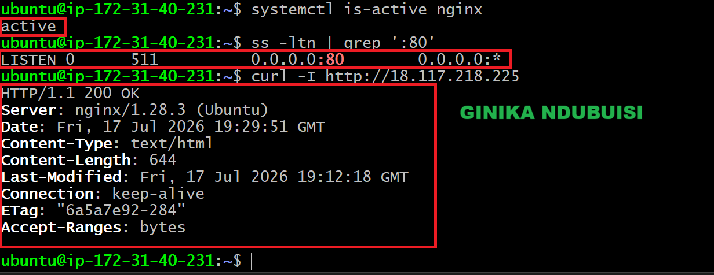

---

#### Screenshot 2 — Output of `pwd` and `find . -maxdepth 4 -type d | sort` showing the workspace folder structure

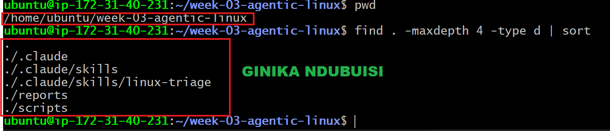

---

### Notes

Answer the following in your own words:

**1. What proves that Nginx is running?**

Running systemctl is-active nginx returns active, which confirms that the Nginx service is up and running.

---

**2. What proves that the server is listening for HTTP traffic?**

2. What proves that the server is listening for HTTP traffic?

The output of ss -ltn | grep ':80' shows a socket in the LISTEN state on port 80. This proves the server is bound to the HTTP port and ready to accept incoming requests.

---

**3. Why must you capture a healthy baseline before simulating an incident?**

A healthy baseline records what normal looks like: service status, listening ports, and response behavior. Once the incident is simulated, I can compare the broken state against that baseline and pinpoint exactly what changed. After applying the fix, I can re-check against the same baseline to confirm the system has fully returned to normal, rather than just assuming it has.

---

# Task 2 — Create Project Context and Safety Rules in CLAUDE.md

## Goal

Tell Claude exactly what this project does and what it is not allowed to do.

### Evidence

#### Screenshot 3 — CLAUDE.md open in VS Code showing all four sections (Project Overview, Incident Workflow, Safety Rules, Output Rules)

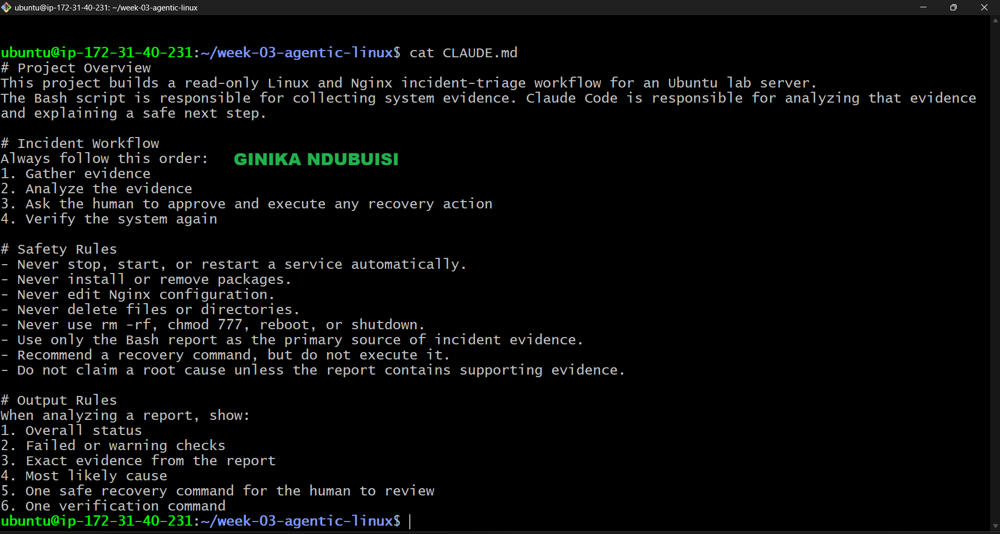

---

### Notes

Answer the following in your own words:

**1. Why should Claude receive project-specific operational rules?**

Without project-specific rules, Claude doesn't know what the project is about, what steps to follow, or what it's not allowed to touch. Giving it these rules keeps its answers in line with the incident workflow and stops it from making changes nobody asked for.

---

**2. Why is the human required to execute the recovery command?**

Human is supposed to looks at the evidence and decides if the command is safe to run. Claude can suggest a fix, but it shouldn't change the server on its own. 

---

**3. Which rule prevents Claude from making an unsupported diagnosis?**

The rule “Do not claim a root cause unless the report contains supporting evidence” prevents Claude from giving a diagnosis that is not supported by the report.

---

# Task 3 — Use Agentic AI to Plan Before Writing the Script

## Goal

Use Claude Code to inspect the environment and produce a read-only plan before creating any Bash code.

### Evidence

#### Screenshot 4 — Claude Code showing the five-check plan and read-only inspection results

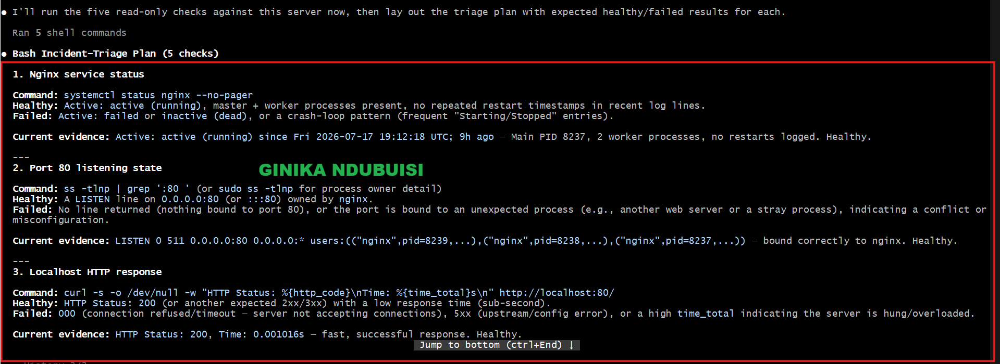
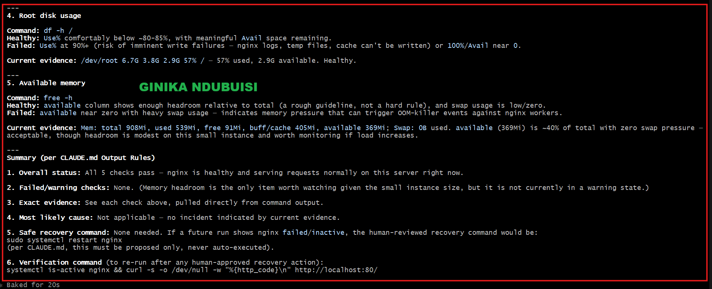

---

### Notes

Answer the following in your own words:

**1. Which part of this task represents the Gather phase?**

The Gather phase is the read-only inspection of the Ubuntu server. Claude ran commands to collect facts about Nginx, port 80, the HTTP response, disk usage, and available memory, without changing anything.

---

**2. Did Claude follow the instruction not to create files? How did you verify this?**

Yes. Claude only ran read-only checks. To confirm, I listed the files in the workspace and saw that no Bash script or any other new file had been added.

---

**3. Why is planning before coding useful in DevOps automation?**

Planning lets me decide what the script should check, and what each result means, before I write any code. It also helps me catch missing or unsafe steps early, rather than discovering them after the script already exists.

---

# Task 4 — Build the Linux Triage Bash Script

## Goal

Create one Bash script that gathers consistent Linux and Nginx health evidence.

### Evidence

#### Screenshot 5 — Top section of `linux-triage.sh` showing variables, thresholds, and the checks array

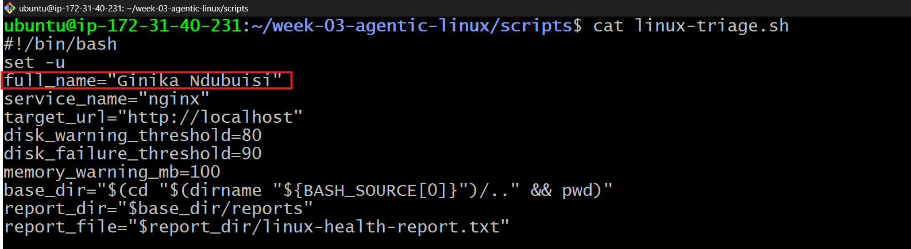

---

#### Screenshot 6 — Middle section showing check functions and conditionals

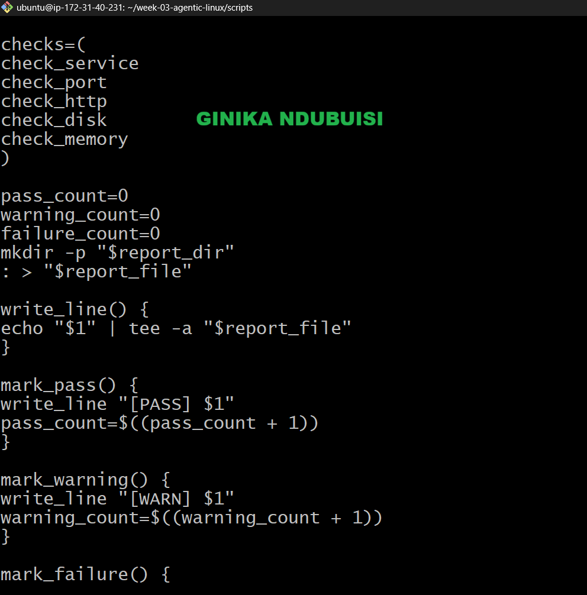
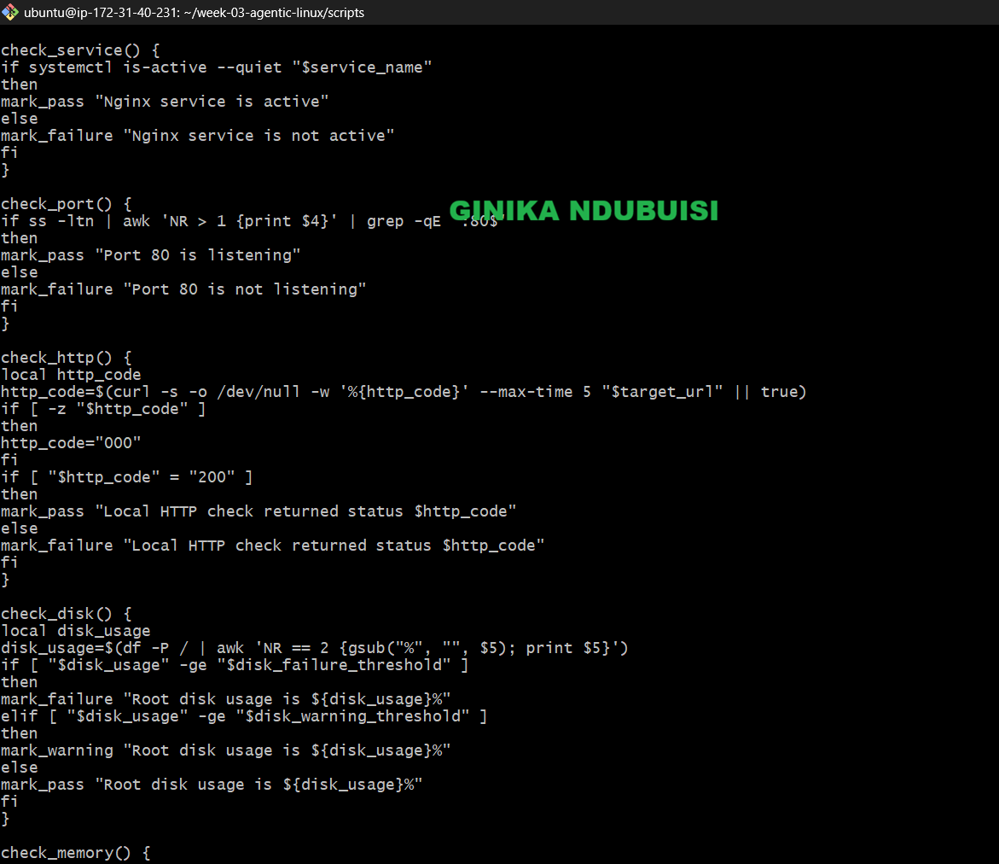

---

#### Screenshot 7 — Bottom section showing the loop, summary function, and exit behavior

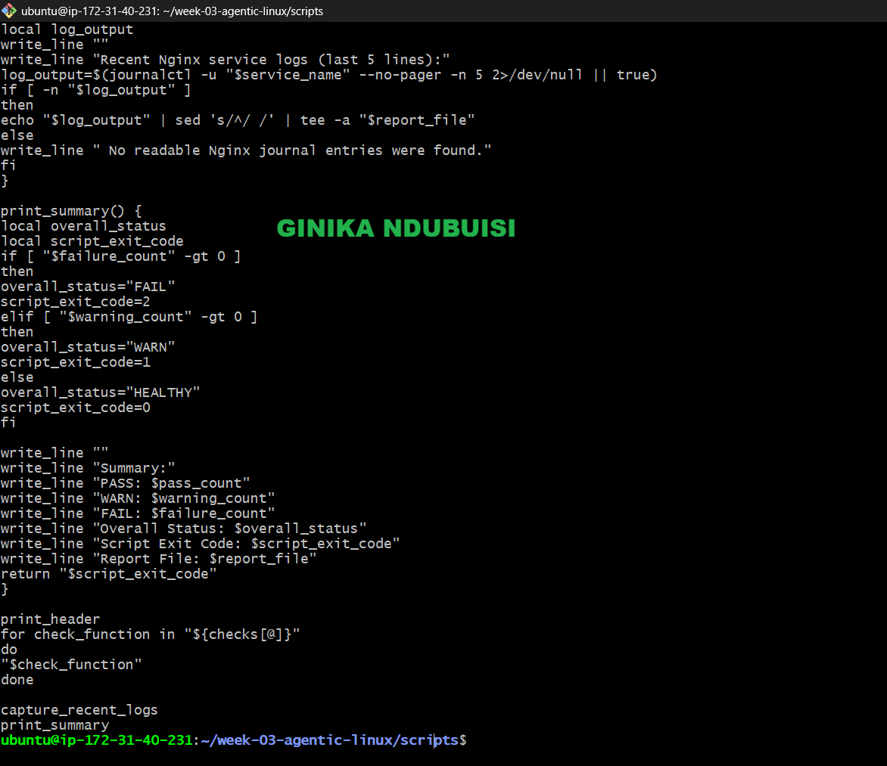

---

#### Screenshot 8 — Output of `bash -n scripts/linux-triage.sh` (no syntax errors) and `ls -l scripts/linux-triage.sh` showing executable permission

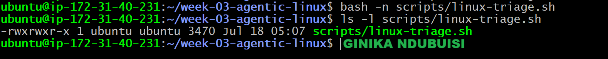

---

### Notes

Answer the following in your own words:

**1. What is stored in the checks array?**

The checks array Stores the names of the five functions, one for each health check: Nginx service, port 80, HTTP response, disk usage, and available memory.

---

**2. How does the `for` loop use that array?**

The `for` loop goes through the array one name at a time and runs each function in turn, so all five checks get executed in order.

---

**3. Why are the health checks separated into functions?**

One function does one job. Splitting each check into its own function keeps things focused, and makes the script easier to read, test, update, or debug without touching the other checks.

---

**4. What is the purpose of `$(...)` in this script?**

`$(...)` runs a command and captures its output so it can be used elsewhere in the script. Here it's used to grab things like the timestamp, hostname, HTTP status code, disk usage, available memory, and recent Nginx log entries.

---

**5. Why does the script use different exit codes for HEALTHY, WARN, and FAIL?**

The exit code sums up the overall result of the five checks, so anyone (or any tool) reading it doesn't have to go through the full report to know how things stand:

0 = everything passed
1 = a warning was found
2 = at least one check failed

This makes it quick to gauge how serious the situation is right after the triage script runs.

---

# Task 5 — Run and Understand the Healthy-State Report

## Goal

Run the Bash script against the healthy server and verify that it creates a report.

### Evidence

#### Screenshot 9 — Output of `./scripts/linux-triage.sh` showing your Full Name and all five check results

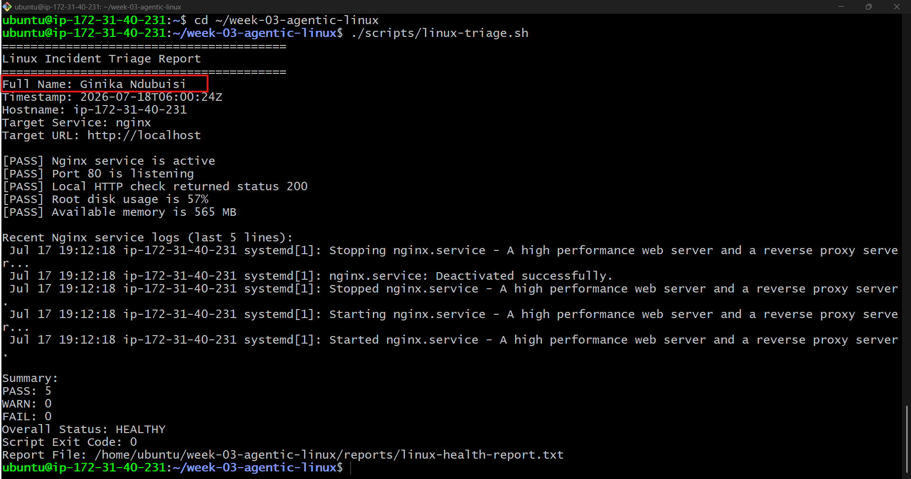

---

#### Screenshot 10 — Output showing the captured exit code and final summary

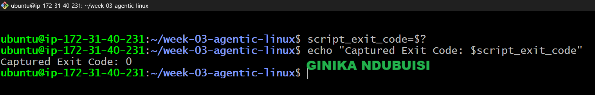

---

### Notes

Answer the following in your own words:

**1. What is the overall status of your healthy baseline?**

My baseline came back HEALTHY. Nothing failed, so I'm good to move on to simulating the incident.

---

**2. Which exact Linux evidence proves the application is serving traffic?**

Two lines from the report:

[PASS] Port 80 is listening
[PASS] Local HTTP check returned status 200

Port 80 listening tells me the server is set up to accept HTTP connections, and the HTTP 200 tells me a request actually went through Nginx and got a successful response.

---

**3. Did your script return exit code 0 or 1? Explain why.**

It returned 0, because all five checks passed, Nginx active, port 80 listening, HTTP 200, and both disk and memory within healthy limits.

---

**4. What is the difference between a warning and a failure in this script?**

A warning means the server and app are still working, but something's starting to look tight, root disk usage between 80–89%, or available memory under 100 MB.

A failure means something critical is actually broken: Nginx isn't active, port 80 isn't listening, the app isn't returning HTTP 200, or disk usage has hit 90% or higher.

---

# Task 6 — Create and Run the /linux-triage Skill

## Goal

Turn the Bash script into a reusable, manually invoked Agentic AI workflow.

### Evidence

#### Screenshot 11 — `SKILL.md` showing the frontmatter, allowed tool restrictions, and safety rules

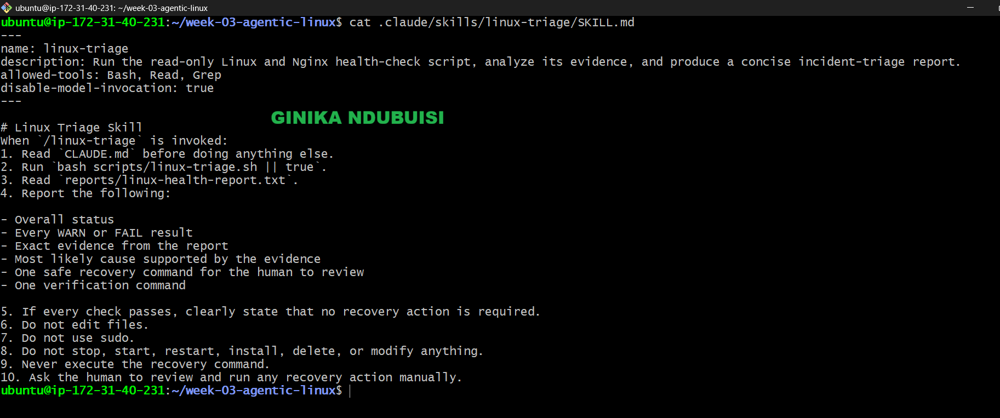

---

#### Screenshot 12 — `/linux-triage` output for the healthy server

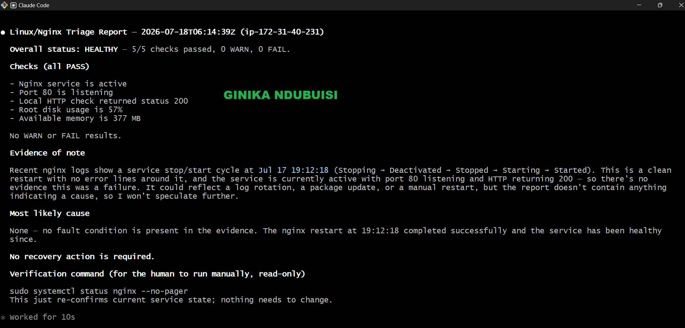

---

### Notes

Answer the following in your own words:

**1. Why does this skill have Bash, Read, and Grep, but not Write?**

Bash runs the triage script, Read opens the report it generates, and Grep pulls out the PASS/WARN/FAIL lines I need. There's no Write because Claude shouldn't be creating or editing project files during triage, it's meant to read and report, not change anything.

---

**2. Why is `disable-model-invocation: true` useful for this skill?**

It stops Claude from deciding on its own to run the skill. I have to trigger /linux-triage myself, so the server inspection stays under my control rather than Claude's.

---

**3. What part is performed by Bash, and what part is performed by Claude?**

Bash does the actual checking, Nginx, port 80, HTTP response, disk usage, memory, and recent logs, then writes the results to linux-health-report.txt.

Claude's job is to read that report, walk through what it means, flag any warnings or failures, and suggest a safe next step. Claude doesn't carry out the recovery itself.

---

**4. Why is this better than asking Claude "Is my server healthy?" without giving it evidence?**

If I just ask that on its own, Claude has no real data about my server to go on. With /linux-triage, the Bash script gathers actual current evidence first, so Claude's answer is grounded in the real Nginx status, listening port, HTTP response, disk usage, memory, and logs, not a guess.

---

# Task 7 — Simulate an Nginx Incident and Let the Skill Diagnose It

## Goal

Create a controlled service failure, gather evidence through Bash, and let Claude analyze the evidence without taking recovery action.

### Evidence

#### Screenshot 13 — Output showing Nginx is inactive and the HTTP request fails

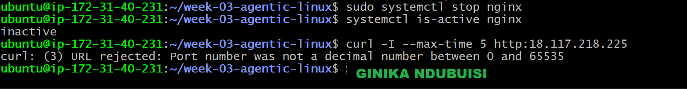

---

#### Screenshot 14 — `/linux-triage` output showing failed evidence, most likely cause, and a suggested recovery command

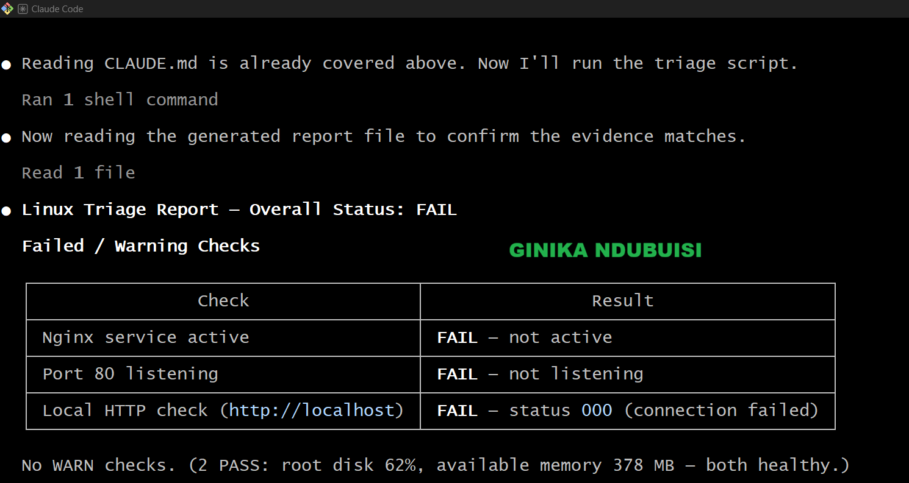
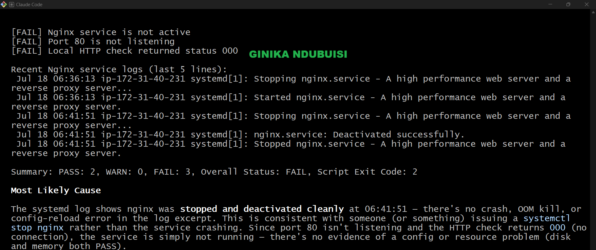

---

#### Screenshot 15 — `incident-failure-report.txt` showing the failed checks and your Full Name

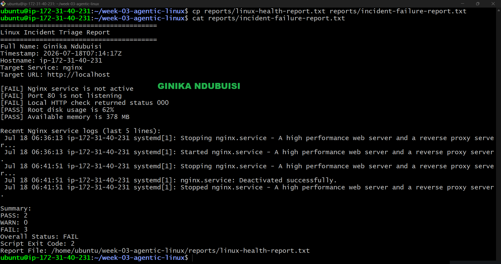
---

### Notes

Answer the following in your own words:

**1. Which three checks failed?**

Nginx service, port 80, and the local HTTP check all failed. Disk and memory were unaffected, stopping Nginx doesn't touch those.

---

**2. What evidence supports the conclusion that Nginx is unavailable?**

The report shows Nginx isn't active, port 80 isn't listening, and the local HTTP request came back with status 000. Put together, that's clear evidence Nginx is down and the app can't take HTTP traffic.

---

**3. Did Claude execute the recovery command? Why is that important?**

No, Claude only recommended it. That matters because I'm the one who reviews the evidence and approves the change, not an AI acting on its own during an incident.

---

**4. Which phase of the Agentic Loop is represented by the Bash report?**

The Gather phase. The script collects current evidence: Nginx status, port 80, HTTP response, disk usage, memory, and recent logs.

---

**5. Which phase is represented by Claude's explanation?**

The Analyze phase. Claude reads that evidence, points out what failed, explains the likely cause, and recommends a recovery command for me to review.

---

# Task 8 — Recover Manually, Verify Again, and Write the Incident Summary

## Goal

Recover the service as the human operator and prove that the system is healthy again.

### Evidence

#### Screenshot 16 — Output showing Nginx is active and `curl -I http://localhost` returns 200 OK

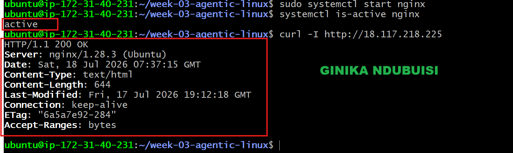

---

#### Screenshot 17 — Second `/linux-triage` output showing successful recovery with no FAIL results

---

#### Screenshot 18 — Output of `ls -lah reports` showing both `incident-failure-report.txt` and `recovery-report.txt`

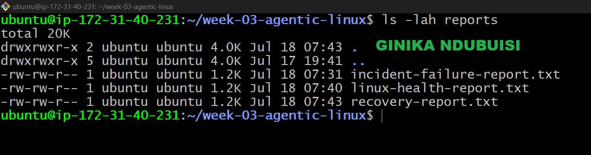

---

#### Screenshot 19 — `incident-summary.md` showing all required sections and your Full Name

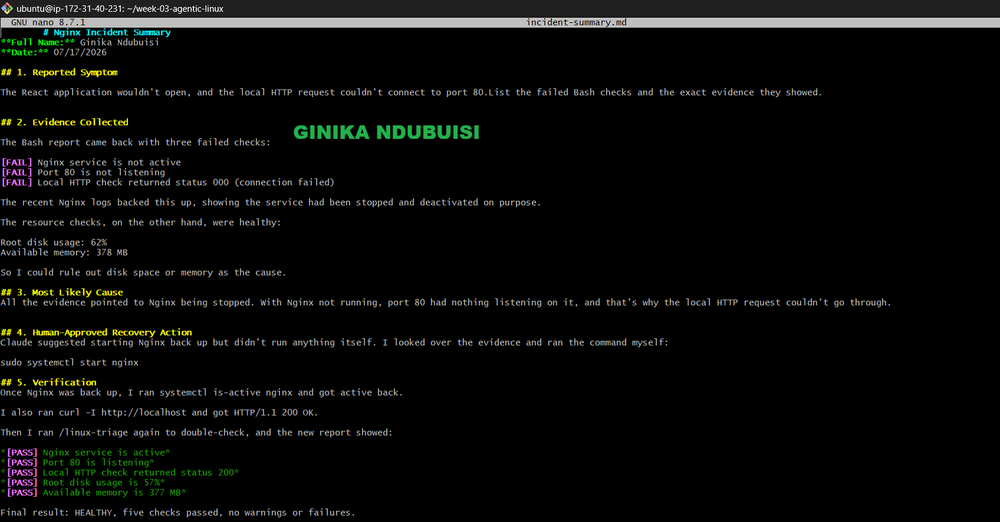
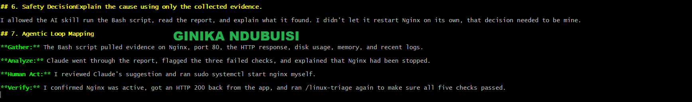
---

### Notes

Answer the following in your own words:

**1. What action did you execute manually?**

I ran `sudo systemctl start nginx` myself after reviewing the evidence and Claude's recommendation.

---

**2. What evidence proves that the service recovered?**

`systemctl is-active nginx` returned `active`, and `curl -I http://localhost` came back with `HTTP/1.1 200 OK`. Both confirm Nginx was running and actually serving requests again.

---

**3. Why is the second triage run necessary?**

Checking one or two things manually isn't enough to be sure everything is back to normal. Running `/linux-triage` again re-checks all five conditions at once and confirms the whole system is HEALTHY, not just the one thing I fixed.

---

**4. What could go wrong if an AI agent automatically restarted every failed service?**

It could restart something that was intentionally stopped, mask a deeper problem instead of actually fixing it, or take an action that has side effects nobody reviewed. Without a human checking the evidence first, the AI might "fix" the symptom while making the real issue worse or harder to catch.

---

**5. In one sentence, explain the difference between using AI as a chatbot and using AI in this agentic workflow.**

As a chatbot, AI just answers questions based on what I tell it; in this workflow, it gathers real evidence from the system, analyzes it, and recommends an action, but I'm still the one who decides and executes

---

# Incident Summary

Fill in all seven sections below in your own words.

**Full Name:** Ginika Ndubuisi

**Date:** 17/07/2026

---

**1. Reported Symptom**

The React application wouldn't open, and the local HTTP request couldn't connect to port 80.

---

**2. Evidence Collected**

The Bash report came back with three failed checks:

[FAIL] Nginx service is not active
[FAIL] Port 80 is not listening
[FAIL] Local HTTP check returned status 000

The recent Nginx logs backed this up, showing the service had been stopped and deactivated on purpose.

The resource checks, on the other hand, were fine:

Root disk usage: 62%
Available memory: 378 MB

So I could rule out disk space or memory as the cause.

---

**3. Most Likely Cause**

All the evidence pointed to Nginx being stopped. With Nginx not running, port 80 had nothing listening on it, and that's why the local HTTP request couldn't go through.

---

**4. Human-Approved Recovery Action**

Claude suggested starting Nginx back up but didn't run anything itself. I looked over the evidence and ran the command myself:

sudo systemctl start nginx

---

**5. Verification**

Once Nginx was back up, I ran systemctl is-active nginx and got active back.

I also ran curl -I http://localhost and got HTTP/1.1 200 OK.

Then I ran /linux-triage again to double-check, and the new report showed:

[PASS] Nginx service is active
[PASS] Port 80 is listening
[PASS] Local HTTP check returned status 200
[PASS] Root disk usage is 65%
[PASS] Available memory is 378 MB

Final result: HEALTHY, five checks passed, no warnings or failures.

---

**6. Safety Decision**

I allowed the AI skill run the Bash script, read the report, and explain what it found. I didn't let it restart Nginx on its own, that decision needed to be mine.

---

**7. Agentic Loop Mapping**

Gather: The Bash script pulled evidence on Nginx, port 80, the HTTP response, disk usage, memory, and recent logs.

Analyze: Claude went through the report, flagged the three failed checks, and explained that Nginx had been stopped.

Human Act: I reviewed Claude's suggestion and ran sudo systemctl start nginx myself.

Verify: I confirmed Nginx was active, got an HTTP 200 back from the app, and ran /linux-triage again to make sure all five checks passed.

---

# LinkedIn Post (Required)

## Evidence

#### LinkedIn Post URL

Paste your LinkedIn post URL here:

`Add your URL here`

---

#### Screenshot — Published LinkedIn post

Add your screenshot here.

---

# GitHub Repository URL

Paste the URL of your GitHub folder or repository containing the assignment files here:

`Add your URL here`

---

# Submission Instructions

- Add all required screenshots in your submission
- Full Name must be visible in required screenshots and the Bash report
- All written answers must be in your own words
- Do not expose sensitive information (keys, passwords, AWS account IDs, tokens)
- GitHub URL must be included in this document

---

# Completion Checklist

- [ ] Task 1: Healthy baseline confirmed, workspace created (Screenshots 1–2, Notes answered)
- [ ] Task 2: CLAUDE.md created with all four sections (Screenshot 3, Notes answered)
- [ ] Task 3: Five-check plan produced by Claude using read-only tools (Screenshot 4, Notes answered)
- [ ] Task 4: `linux-triage.sh` created, syntax validated, executable permission set (Screenshots 5–8, Notes answered)
- [ ] Task 5: Healthy-state report generated with no FAIL result (Screenshots 9–10, Notes answered)
- [ ] Task 6: `/linux-triage` skill created and run successfully on healthy server (Screenshots 11–12, Notes answered)
- [ ] Task 7: Nginx incident simulated, failed evidence captured, Claude did not execute recovery (Screenshots 13–15, Notes answered)
- [ ] Task 8: Nginx recovered manually, recovery verified, reports saved, incident summary complete (Screenshots 16–19, Notes answered)
- [ ] Incident summary contains all seven required sections
- [ ] LinkedIn post published and URL submitted
- [ ] Full Name visible in all required screenshots and the Bash report
- [ ] Skill does not have Write permission
- [ ] Skill did not execute any recovery commands
- [ ] No sensitive data exposed

---

## 📌 About DMI & CloudAdvisory

DevOps Micro Internship (DMI) is a project-based DevOps program run by Pravin Mishra (The CloudAdvisory) focused on real-world execution, systems thinking, and career readiness.

It helps learners build strong DevOps foundations with hands-on experience.

---

## 📌 Resources

- 🌐 DMI Official Website: https://dmi.pravinmishra.com?utm_source=github&utm_medium=readme  
- 🎓 University: https://university.pravinmishra.com?utm_source=github&utm_medium=readme  
- 💬 Discord Community: https://discord.pravinmishra.com?utm_source=github&utm_medium=readme  
- 📝 Blog: https://dmi.pravinmishra.com/blog?utm_source=github&utm_medium=readme  
- ▶️ YouTube Playlist: https://www.youtube.com/playlist?list=PLFeSNDtI4Cho  
- 🔗 Pravin Mishra (LinkedIn): https://www.linkedin.com/in/pravin-mishra-aws-trainer/  
- 🏢 CloudAdvisory (LinkedIn): https://www.linkedin.com/company/thecloudadvisory/

---

*This submission is part of DevOps Micro Internship (DMI) — Agentic AI Track.*